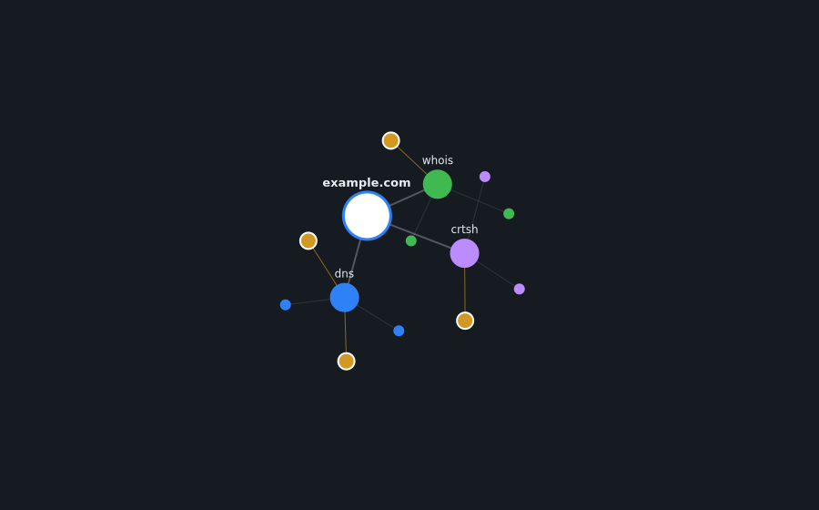
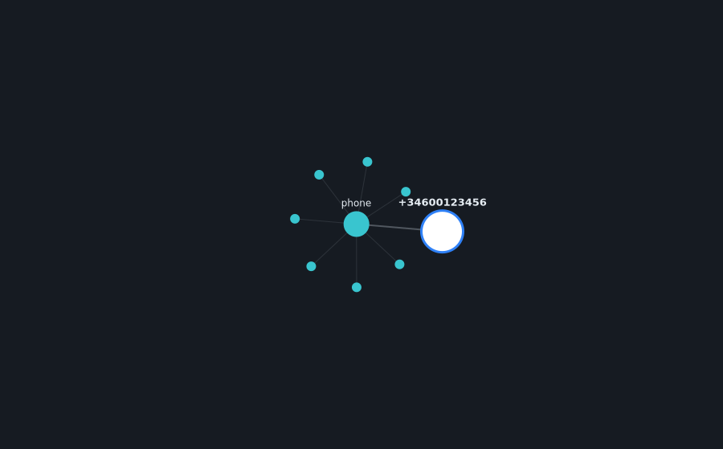

# 🔍 OSINT All-in-One

Open-source intelligence dashboard that aggregates **multiple free sources** into a single API and unified panel. Enter a target — domain, email, username, or phone — and the tool auto-detects the type, runs all compatible sources in **parallel**, normalizes the results, and correlates data across modules.

> ⚠️ **Ethical use.** This tool only queries **public** information. Use it only on targets you own or are authorized to scan. Respect each source's Terms of Service and applicable law. The author is not responsible for misuse.

---

## ✨ Features

- **Target selection**: choose the type (domain, email, username, phone) with a selector, or leave it on **Auto** for automatic detection.
- **Country code selector**: when scanning a phone, a dropdown with +45 countries (flag + code) lets you enter only the local number.
- **Concurrent execution**: all sources run in parallel using `asyncio`.
- **Plugin architecture**: adding a new source is creating one class; you do not touch the core.
- **Normalized output**: every source returns the same structure (`Finding`), ready for the frontend.
- **No false positives**: every item comes from a verifiable response (authoritative DNS, HTTP 200 from Gravatar, exact match…). No guesswork.
- **Correlation engine**: cross-references data appearing in multiple sources.
- **Interactive graph view**: force-directed graph drawn on canvas (no libraries), with the target at the center, module branches, and correlated nodes highlighted.
- **Animated background**: node network on canvas (ARIADNE philosophy — the thread that connects data) using the same palette as the graph.
- **Resilient**: if one source fails or is slow, the rest of the scan continues (crt.sh even retries transient 502s).
- **100% free**: no API key required to run.

## 🧩 Included sources (no API key)

| Target     | Module    | What it collects                                                                                      |
|------------|-----------|--------------------------------------------------------------------------------------------------------|
| Domain     | `dns`     | A, AAAA, MX, NS, TXT, **SOA, CAA** records; **DMARC** policy; labeled **SPF**; **Reverse DNS (PTR)**; **MTA-STS / TLS-RPT / BIMI**; **DNSSEC**; **www** host; recognized **service-verification tokens** (Google/Microsoft/Facebook/Stripe…) |
| Domain     | `whois`   | Registrar (+ **URL**), WHOIS server, dates (creation/update/expiration), **days until expiration**, **domain age**, **EPP status**, **DNSSEC**, nameservers, registrant, location, emails |
| Domain     | `crtsh`   | Subdomains via Certificate Transparency + **count**, **cert entries**, **wildcard detection** and **issuing CAs**            |
| Email      | `email`   | **Address analysis** (valid format, role-based/disposable, Gmail canonical form, plus-tag), Gravatar (avatar, name, **location, bio, links**, MD5+**SHA-256**), **mail provider (MX)**, whether the domain **hosts a website**, **SPF/DMARC/MTA-STS**, and **pivots** (candidate username, web/GitHub search) |
| Username   | `username`| Presence on 150+ platforms via **Maigret** (real detection) + **profile count**                        |
| Phone      | `phone`   | Validity, formats (E.164/intl/national), country + **flag**, region, **carrier** (mobile only), timezone, line type, length, and **pivot links** (WhatsApp/Telegram/Truecaller/**Sync.me**/**Facebook**/search) filtered by line type |

> **Key-based modules** (`shodan`, `hibp`) are already included as optional plugins — they activate automatically when you set their API key in `.env`. See [Optional key-based modules](#-optional-key-based-modules).

## 🖼️ Graph view

The dashboard includes a graph view (force-directed, drawn on canvas without external libraries) that places the target at the center, branches each module, and highlights correlated nodes between sources.



*Example with a domain: yellow nodes with white borders (`ns1.example.com`, `mail.example.com`) appear in two sources at once.*



*Example with a phone: one module with multiple attributes.*

## 🏗️ Architecture

```
Frontend (dashboard)
        │  POST /scan
        ▼
FastAPI ──▶ Type detector ──▶ Async orchestrator
                                      │  (runs compatible modules in parallel)
                ┌─────────────┬───────┼────────┬──────────┐
              dns          whois    crtsh    email  username  phone   ← plugins
                └─────────────┴───────┼────────┴──────────┘
                                      ▼
                         Normalizer (Pydantic)
                                      ▼
                          Correlation engine
                                      ▼
                            Unified JSON response
```

## 🚀 Getting started

### Option A — Docker (recommended)

```bash
docker compose up --build
```

- API:       http://localhost:8000  (interactive docs at `/docs`)
- Dashboard: http://localhost:8080

### Option B — Local

**Backend:**
```bash
cd backend
python -m venv .venv && source .venv/bin/activate   # on Windows: .venv\Scripts\activate
pip install -r requirements.txt
uvicorn app.main:app --reload
```

**Frontend:** open `index.html` (at the repo root) in your browser (or serve it with any static server). Point it to `http://127.0.0.1:8000`.

## 📡 API

| Method | Path                | Description                                            |
|--------|---------------------|--------------------------------------------------------|
| GET    | `/health`           | Healthcheck                                            |
| GET    | `/modules`          | List modules, supported types and whether each is available |
| POST   | `/scan`             | Scan a target                                          |
| GET    | `/history`          | List recent scans (newest first). Query: `?limit=50`   |
| GET    | `/history/{id}`     | Retrieve a stored scan by id                           |

The `/scan` body accepts:

| Field         | Type   | Required | Description                                                                 |
|---------------|--------|----------|-----------------------------------------------------------------------------|
| `target`      | string | Yes      | The target to scan.                                                          |
| `target_type` | string | No       | Force the type (`domain`/`email`/`username`/`phone`). If omitted or `auto`, it autodetects. |

**Example (auto-detect):**
```bash
curl -X POST http://localhost:8000/scan \
  -H "Content-Type: application/json" \
  -d '{"target": "github.com"}'
```

**Example (forced type):**
```bash
curl -X POST http://localhost:8000/scan \
  -H "Content-Type: application/json" \
  -d '{"target": "torvalds", "target_type": "username"}'
```

## ➕ Adding a new source

1. Create `backend/app/modules/my_source.py`:

```python
from ..core.base import OSINTModule, register
from ..core.models import Finding, TargetType

@register
class MySource(OSINTModule):
    name = "my_source"
    supported_types = [TargetType.DOMAIN]

    async def _run(self, target: str) -> list[Finding]:
        # ... your logic ...
        return [Finding(label="Something", value="value", category="cat")]
```

2. Import it in `backend/app/modules/__init__.py`.

That is all — the orchestrator detects it and uses it automatically.

## 🔑 Optional key-based modules

Some modules use paid / key-gated APIs. They stay **disabled** until you provide
their key, and activate automatically once it is set (no code changes needed):

| Module   | Target | Env var          | What it adds                                         |
|----------|--------|------------------|------------------------------------------------------|
| `shodan` | Domain | `SHODAN_API_KEY` | Resolved IP, organization, open ports, services, CVEs |
| `hibp`   | Email  | `HIBP_API_KEY`   | Whether the email appears in known data breaches      |

Copy `backend/.env.example` to `backend/.env` and fill in the keys you have.
`GET /modules` reports each module's `available` flag so you can see what's active.

## ⚡ Caching & 🕘 history

- **Redis cache (optional).** Set `REDIS_URL` (e.g. `redis://localhost:6379/0`) to
  cache scan results for `CACHE_TTL` seconds (default 3600). Repeated scans of the
  same target return instantly and are flagged `cached` in the response. If Redis is
  unset or unreachable, caching is silently skipped — scans still work.
- **Persistent history.** Every scan is stored (SQLite by default, at `HISTORY_DB`,
  default `ariadne_history.db`). Browse it from the **🕘 History** button in the UI,
  or via `GET /history` and `GET /history/{id}`.

The Docker setup wires Redis and a persistent history volume automatically.

## 📤 Export

From the results bar you can export any scan as **JSON** (⬇ JSON) or as a printable
**PDF** (🖨 PDF, via the browser's print dialog).

## 🗺️ Roadmap

- [x] ~~Visual graph of entity relationships.~~ ✅
- [x] ~~Maigret username module integration.~~ ✅
- [x] ~~Target type selector + country code dropdown.~~ ✅
- [x] ~~Searchable phone picker with image-based country flags + digits-only input.~~ ✅
- [x] ~~Enhanced modules (DMARC/SPF/PTR, DNSSEC, CAs, phone pivots…).~~ ✅
- [x] ~~Redis cache to avoid repeated queries.~~ ✅
- [x] ~~Persistent scan history (SQLite by default; `HISTORY_DB` swappable).~~ ✅
- [x] ~~Optional paid plugins (Shodan, HIBP) toggleable via `.env`.~~ ✅
- [x] ~~Export reports (JSON / PDF).~~ ✅
- [ ] Auth + multi-user workspaces.
- [ ] Scheduled re-scans with change alerts.

## ⚙️ Username module configuration (Maigret)

The `username` module uses [Maigret](https://github.com/soxoj/maigret) and supports two optional environment variables:

| Variable            | Default | Description                                             |
|---------------------|---------|---------------------------------------------------------|
| `MAIGRET_TOP_SITES` | `150`   | Number of top-ranked sites to check                      |
| `MAIGRET_TIMEOUT`   | `10`    | Timeout per site, in seconds                             |

Increasing `MAIGRET_TOP_SITES` improves coverage but slows scans.

## 📄 License

MIT. See the `LICENSE` file.
